# Hosting a markdown formatted resume on Github Pages
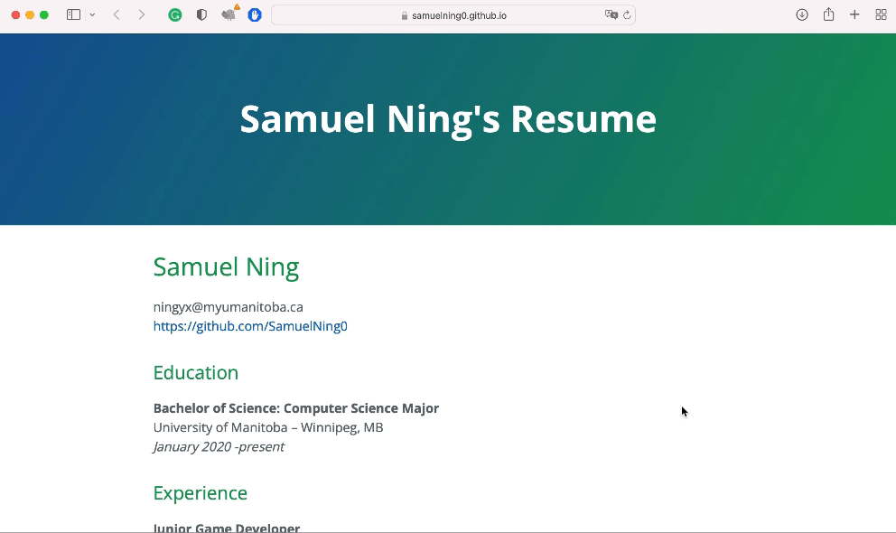
## Purpose
This README tutorial goes over the practical steps of hosting a markdown formatted resume on a github page. Meanwhile these steps will showcase the key principles explained in the book *Modern Technical Wring* by Andrew Etter, including using a lightweight markup languages, using a static site generator and hosting documents on a distributed version control system.

---
## Prerequisites
1. Make sure you have an **up-to-date resume properly formatted in markdown**. We need a markdown formated resume to generate a static website. Markdown is a popular lightweight markup language to write your document. You can learn about markdown [here](https://www.markdowntutorial.com/) or check out [More Resources](#resources) if you are not familar with markdown.
2. You must have a **github account**. If you don't have one, [create a github account here](https://github.com).
3. Have a text editor installed on your computer (such as [Visual Studio code](https://code.visualstudio.com)).

---
## Instructions
### Step 1: Create a personal repository on Github
1. Sign in to your [github](https://github.com) account.
2. Click the plus sign on the top right corner to create a new repositoy.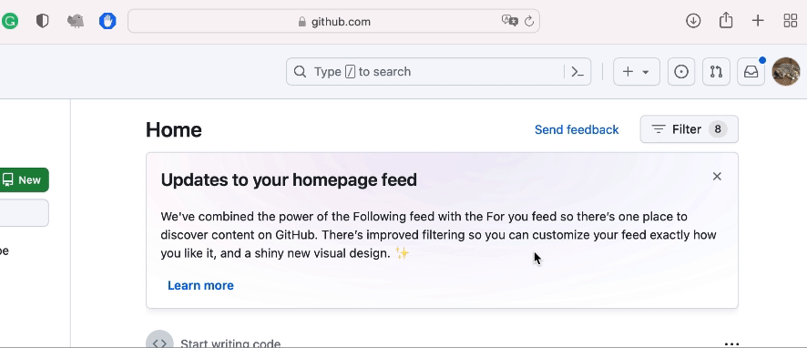
3. Name your repository "yourUserName.github.io".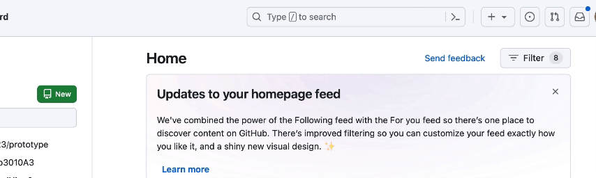
4. Choose "Public" option for your repository.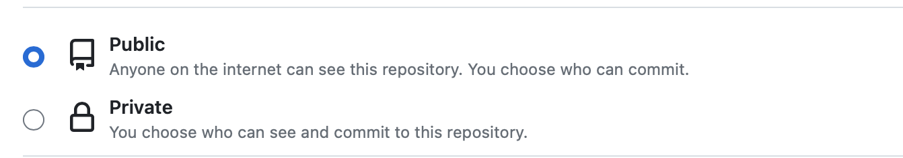
5. Click "Create Repository" to create your personal repository.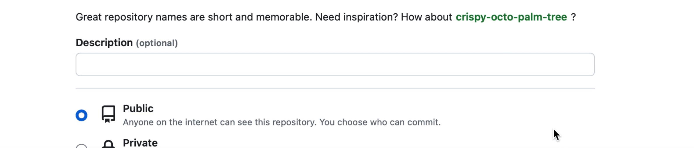

### Step 2: Clone the repository to your local machine.
1. Install [Github Desktop](https://desktop.github.com). 
2. Sign in to github desktop with your github account. 
3. Click "File" on the top left corner to clone the repository.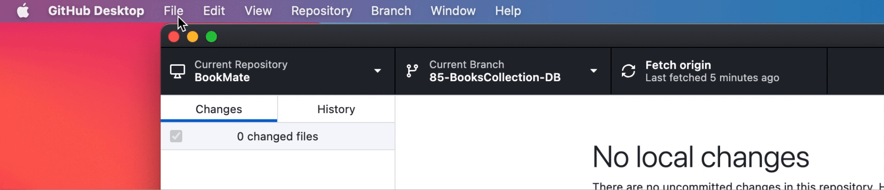
4. Choose a folder that you want to save the repository to.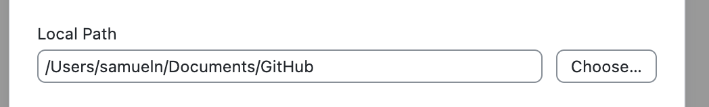
5. Select the repository you created in step 1.3 \(yourUserName.github.io).
6. Click "Clone" to finish cloning the repository from Github to your local machine. 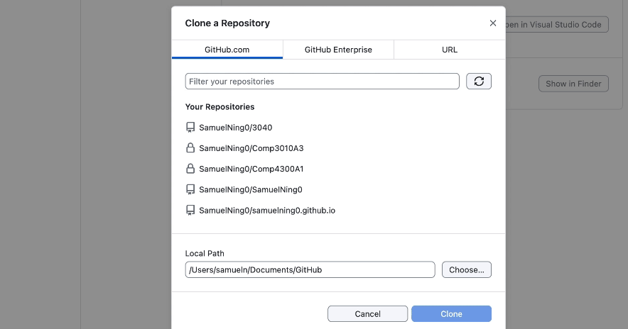
7. Select "main" for your current branch.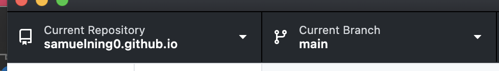

### Step 3: Add your resume to your local repository.
1. Go to the Repository folder \(yourUserName.github.io) you saved in Step 2.4.
2. Put your \"resume.md\" in this folder. 
3. Rename your resume to \"index.md\".

### Step 4. Configure theme for your resume.
1. Go to [this website](https://pages.github.com/themes/) to choose a theme you like. 
2. Open Visual Studio Code or any other text editor.
3. Create a file named "_config.yml" in your local repository folder from Step 2.4. 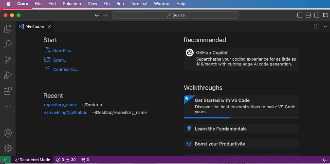
4. Put "theme: jekyll-theme-cayman" in your "_config.yml" file (you can replace the "cayman" with the theme of your choice).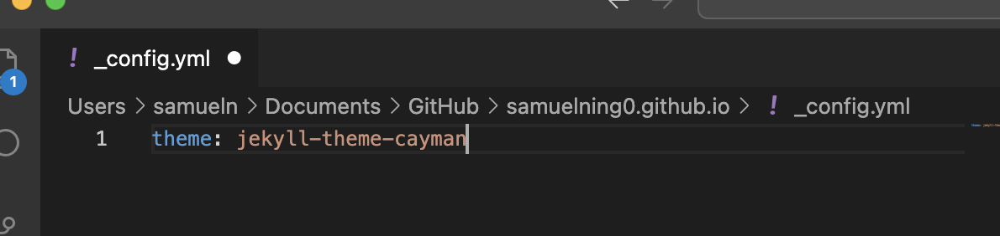
5. Save the file "_config.yml".

### Step 5. Push your changes to github.
1. Open Github Desktop. 
2. Set your current repository to \"yourUserName.github.io\" if it is not selected.
3. Select "main" for your current branch if it is not selected.
4. Select \"index.md\" and "_config.yml" for the files you want to push.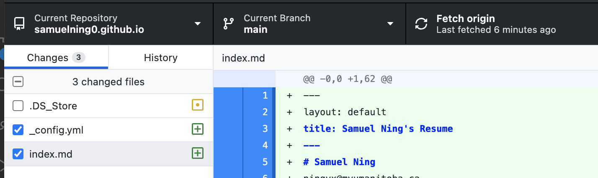
5. Write a summary for your changes.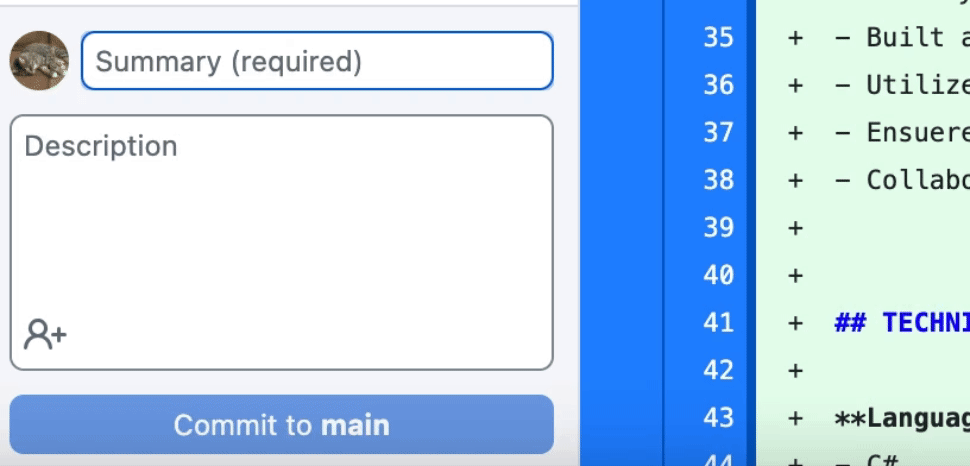
6. Click "Commit to main" button on the bottome left corner.
7. Click "Push origin" to push your changes to the remote repository on github. 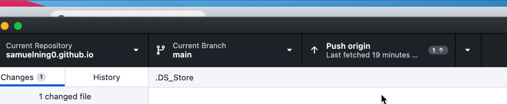

### Step 6. Setup your static page on github. 
1. Sign in to your [github](https://github.com) account.
2. CLick the hamburger button on the top left corder to go to your repository \"yourName.github.io\".
---
## More Resources {#resources}