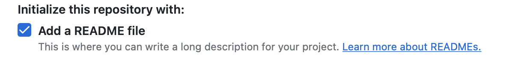
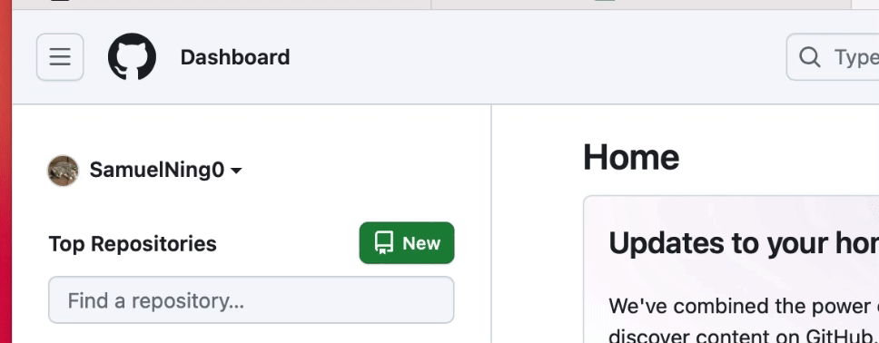
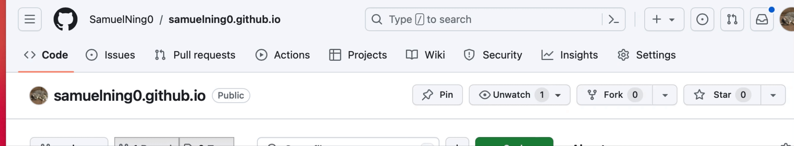
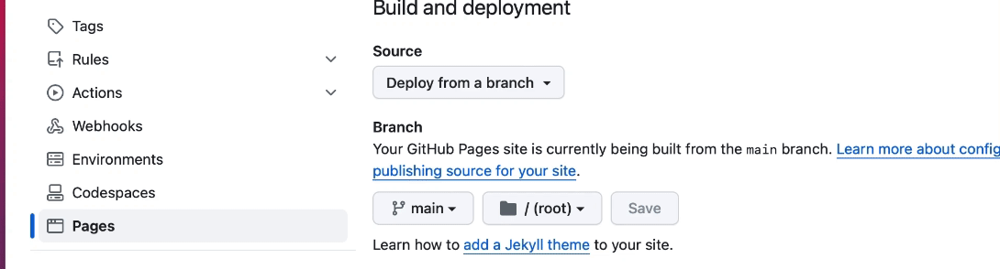
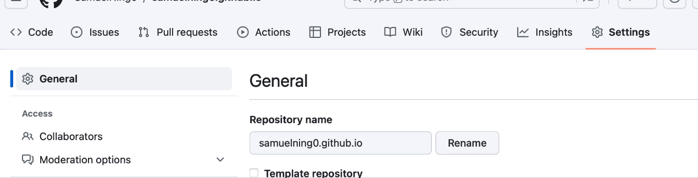
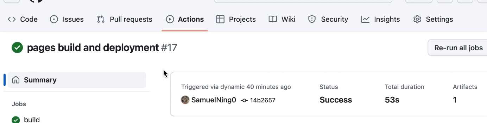

# Hosting a markdown formatted resume on Github Pages

## Purpose
This README tutorial goes over the practical steps of hosting a markdown formatted resume on a github page. Meanwhile these steps will showcase the key principles explained in the book *Modern Technical Writing* by Andrew Etter, including using a lightweight markup languages, using a static site generator and hosting documents on a distributed version control system.

---
## Prerequisites
1. Make sure you have an **up-to-date resume properly formatted in markdown**. We need a markdown formated resume to generate a static website. Markdown is a popular lightweight markup language to write your document. You can learn about markdown [here](https://www.markdowntutorial.com/) or check out [More Resources](#resources) if you are not familar with markdown.
2. You must have a **github account**. If you don't have one, [create a github account here](https://github.com).
3. Have a text editor installed on your computer (such as [Visual Studio code](https://code.visualstudio.com)).

---
## Instructions
### Step 1: Create a personal repository on Github
> Github is distributed version control system (DVCS) using git behind the scene. You can imagine github as a folder that everyone can access and copy to their local machine. Git is your asistant that keeps every changes you make in the folder. As discuessed in *Modern Technical Writing*, "all sorts of people have extolled the virtues of distributed version control systems (DVCS) like Git." Etter believes that technical writers can benifit from using DVCS as it is widely used by developers. Using DVCS makes it easier for everyone to contribute to the documentation. Moreover, github keeps track of all the changes to your resume and your reader can always see your most up-to-date resume.
1. Sign in to your [github](https://github.com) account.
2. Click the plus sign on the top right corner to create a new repositoy.
3. Name your repository "yourUserName.github.io".
4. Choose "Public" option for your repository.
5. Select "Add a README file".
   > According to Etter's book, all repositories should have a "README" file containing summry, instructions on how to contribute etc. We are not using it here but it's good practice to include one.
6. Click "Create Repository" to create your personal repository.

### Step 2: Clone the repository to your local machine.
> According to Etter's book, DVCS allow people to clone the repository and work on it offline. 
1. Install [Github Desktop](https://desktop.github.com). 
2. Sign in to github desktop with your github account. 
3. Click "File" on the top left corner to clone the repository.
4. Choose a folder that you want to save the repository to.
5. Select the repository you created in step 1.3 \(yourUserName.github.io).
6. Click "Clone" to finish cloning the repository from Github to your local machine. 
7. Select "main" for your current branch.

### Step 3: Add your resume to your local repository.
> Resume must be formatted in Markdown, a popular lightweight markup language mentioned in Etter's book. Markdown is easy to learn, a lot shorter than XML-based languages and has a broad compatibility with many platforms. It can be converted to variety of formats including HTML and PDF.
1. Go to the Repository folder \(yourUserName.github.io) you saved in Step 2.4.
2. Put your \"resume.md\" in this folder. 
3. Rename your resume to \"index.md\".

### Step 4. Configure theme for your resume.
> Etter recommends using a customized theme when building a static webpage to make it stand out. We are using GitHub's default jekyll theme here for simplicity. Check out [resources](#resources) for using remote themes.
1. Go to [this website](https://pages.github.com/themes/) to choose a theme you like. 
2. Open Visual Studio Code or any other text editor.
3. Create a file named "_config.yml" in your local repository folder from Step 2.4. 
4. Put "theme: jekyll-theme-cayman" in your "_config.yml" file (you can replace the "cayman" with the theme of your choice).
5. Save the file "_config.yml".

### Step 5. Push your changes to github.
> Catalog the diff: Etter recommends recording changes to a product. Github keep track of the changes for you and allow you to document the changes you make.
1. Open Github Desktop. 
2. Set your current repository to \"yourUserName.github.io\" if it is not selected.
3. Select "main" for your current branch if it is not selected.
4. Select \"index.md\" and "_config.yml" for the files you want to push.
5. Write a summary for your changes.
6. Click "Commit to main" button on the bottome left corner.
7. Click "Push origin" to push your changes to the remote repository on github. 

### Step 6. Publish your static page on github. 
> Etter recommands hosting a website for documentation instead of using PDFs or words, since website does not go out-of-date. Etter mentioned several advantages of using a static webpage:
> 1. Static webpage does not depend on server. We easily migrate our resume webpage from Github to other hosts.
> 2. Static webpage can be easily generated from markdown, using Jekyll. 
> 3. We can generate webpage and test it locally. In this tutorial we can using Github's built in Jekyll to generate a webpage for simplicity. You can check out [resources](#resources) for buiding and testing a webpage locally.
1. Sign in to your [github](https://github.com) account.
2. CLick the hamburger button on the top left corder to go to your repository \"yourName.github.io\".
3. Go to your repository setting on the top right corner.
4. Navigate to "Pages" section on the left sidebar.
5. Select "Deploy from a branch" as your webpage source.
6. Select "main" as the branch to deploy your webpage from.
7. Click the "Save" button. 
8. Naviage to "Action" tab where you can see your static website is being deployed.
9.  Click "pages build and deployment" and you can see your static website link once it is ready.

___
# FAQs
### Why is my resume not showing up?
* You need to ensure your resume file is named as "index.md" for GitHub to use it as the homepage. 

### Why is Markdown better than a word processor?
* Markdown is better than a word processor because Markdown is more widely supported across platforms, it is portable and easy to learn. Moreover, Markdown is compatible with version control systems like Git, allowing  tracking changes. 

---
## More Resources{#resources}
- [Markdown Tutorial](https://www.markdowntutorial.com): A step-by-step markdown tutorial that covers common syntax in Markdown, along with examples and practices.
- [Markdown Guide](https://www.markdownguide.org/getting-started/): An overview of Markdown, how it works, and what you can do with it.
- [Geekflare](https://geekflare.com/best-markdown-editors/): A list of several good markdown editors.
- ["Modern Technical Writing" by Andrew Etter](https://www.amazon.com/Modern-Technical-Writing-Introduction-Documentation-ebook/dp/B01A2QL9SS): This book discuesses some key principles in technical documentation that we follow in this tutorial.
- [Jekyll Quick Start Guide](https://jekyllrb.com/docs/): A quick tutorial for installing Jekyll locally and generating a static webpage from markdown file on your own machine.
- [Beautiful Jekyll](https://beautifuljekyll.com/getstarted/#install-steps-hard): A tutorial for using remote themes.
___
## Authors and Acknowledgements 
### Author
* [Samuel Ning](https://github.com/SamuelNing0/samuelning0.github.io)
### Acknowledgements:

This tutorial follows documentation principles from Andrew Etter's book Modern Technical Writing. Thanks to my group members Yuelang Zhang and Kim Wills for editting my Readme file. 
